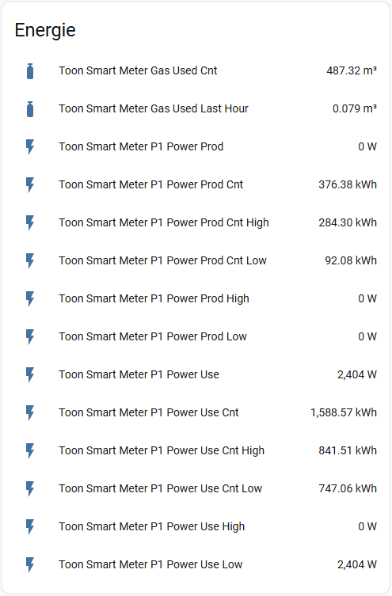

[![GitHub Release][releases-shield]][releases]
[![GitHub Activity][commits-shield]][commits]
[![License][license-shield]](LICENSE)
![Project Maintenance][maintenance-shield]

[](https://www.paypal.me/cyberjunkynl/)
[](https://github.com/sponsors/cyberjunky)

# Toon Smart Meter Custom Integration

A Home Assistant custom integration that reads sensor values from the meter adapter connected to a rooted Toon thermostat. Get real-time insights into gas usage, electricity consumption, solar production, and more.

## Supported Features

Monitor your smart meter with these sensors:

- **Gas Used Last Hour** - Current gas flow
- **Gas Used Total** - Total gas consumption
- **P1 Power Use** - Total electricity usage (all tariffs combined)
- **P1 Power Use Low/High** - Electricity usage by tariff
- **P1 Power Prod** - Total electricity production (all tariffs combined)
- **P1 Power Prod Low/High** - Electricity production by tariff
- **Energy counters** - Total consumption/production
- **Solar Power/Energy** - Solar production (if available)
- **Heat** - District heating (if available)
- **Water Flow/Quantity** - Water usage (if available)

All sensors are created by default and grouped under a single device for easy management.

## Screenshots



## Requirements

- **Rooted Toon thermostat** (available in the Netherlands and Belgium as Boxx)
- Network access to your Toon device

For rooting instructions, visit the [Eneco Toon Domotica Forum](http://www.domoticaforum.eu/viewforum.php?f=87).

## Installation

### HACS (Recommended)

[](https://my.home-assistant.io/redirect/hacs_repository/?owner=cyberjunky&repository=home-assistant-toon_smartmeter&category=integration)

Alternatively:

1. Install [HACS](https://hacs.xyz) if not already installed
2. Search for "Toon Smart Meter" in HACS
3. Click **Download**
4. Restart Home Assistant
5. Add via Settings → Devices & Services

### Manual Installation

1. Copy the `custom_components/toon_smartmeter` folder to your `<config>/custom_components/` directory
2. Restart Home Assistant
3. Add via Settings → Devices & Services

## Configuration

### Adding the Integration

1. Navigate to **Settings** → **Devices & Services**
2. Click **+ Add Integration**
3. Search for **"Toon Smart Meter"**
4. Enter your configuration:
   - **Host**: Your Toon's IP address
   - **Port**: Default is `80`
   - **Name**: Friendly name prefix (default: "Toon")
   - **Update Interval**: Seconds between updates (default: `10`)

The integration validates your connection and creates all sensors automatically. Disable sensors you don't need via **Settings** → **Devices & Services** → **Toon Smart Meter** → click a sensor → cogwheel icon → "Enable entity" toggle.

### Migrating from YAML

> **Note:** YAML configuration is deprecated as of v2.0.0

If you previously configured this integration in `configuration.yaml`, your settings will be **automatically imported** on your first restart after updating.

**Your old YAML config** (will be migrated):

```yaml
sensor:
  - platform: toon_smartmeter
    host: 192.168.1.100
    port: 80
    scan_interval: 10
    resources:  # Ignored - all sensors are now created
      - gasused
      - gasusedcnt
      ...
```

**After migration:**

1. Remove the YAML configuration from `configuration.yaml`
2. Manage all settings via **Settings** → **Devices & Services** → **Toon Smart Meter** → **Configure**
3. Disable unwanted sensors through entity settings

### Modifying Settings

Change integration settings without restarting Home Assistant:

1. Go to **Settings** → **Devices & Services**
2. Find **Toon Smart Meter**
3. Click **Configure** icon
4. Modify name or scan interval
5. Click **Submit**

Changes apply immediately. To enable/disable individual sensors, click on the sensor entity and toggle "Enable entity".

## Energy Dashboard

You can configure your Energy Dashboard for electricity, water and gas tracking by adding the separate sensors to the energy dashboard.

## Advanced Usage

### Utility Meters for Daily/Monthly Tracking

Track energy consumption per day, week, and month:

```yaml
utility_meter:
  electricity_daily:
    name: "Electricity Used Today"
    source: sensor.toon_smart_meter_p1_power_use_cnt
    cycle: daily
  
  electricity_monthly:
    name: "Electricity Used This Month"
    source: sensor.toon_smart_meter_p1_power_use_cnt
    cycle: monthly

  gas_daily:
    name: "Gas Used Today"
    source: sensor.toon_smart_meter_gas_used_cnt
    cycle: daily
```

### Alert on High Energy Usage

Get notified when power consumption spikes (e.g., someone left an appliance on):

```yaml
automation:
  - alias: "High Power Usage Alert"
    trigger:
      - platform: numeric_state
        entity_id: sensor.toon_smart_meter_p1_power_use
        above: 3000
        for:
          minutes: 10
    action:
      - service: notify.mobile_app
        data:
          title: "⚡ High Power Usage"
          message: "Power consumption at {{ states('sensor.toon_smart_meter_p1_power_use') }}W for 10 minutes"
```

### Detect Appliance Running

Detect when the washing machine or dryer is running based on power patterns:

```yaml
template:
  - binary_sensor:
      - name: "Washing Machine Running"
        state: >
          {{ states('sensor.toon_smart_meter_p1_power_use') | float(0) > 200 }}
        delay_off:
          minutes: 5

automation:
  - alias: "Washing Machine Finished"
    trigger:
      - platform: state
        entity_id: binary_sensor.washing_machine_running
        from: "on"
        to: "off"
    action:
      - service: notify.mobile_app
        data:
          message: "🧺 Washing machine cycle complete!"
```

### Solar Self-Consumption Optimization

Automatically start devices when solar production exceeds consumption:

```yaml
template:
  - sensor:
      - name: "Net Power"
        unit_of_measurement: "W"
        state: >
          {{ (states('sensor.toon_smart_meter_p1_power_use') | float(0)) - 
             (states('sensor.toon_smart_meter_p1_power_prod') | float(0)) }}

automation:
  - alias: "Solar Surplus - Start EV Charging"
    trigger:
      - platform: numeric_state
        entity_id: sensor.toon_smart_meter_p1_power_prod
        above: 2000
        for:
          minutes: 5
    condition:
      - condition: numeric_state
        entity_id: sensor.toon_smart_meter_p1_power_use
        below: 500
    action:
      - service: switch.turn_on
        target:
          entity_id: switch.ev_charger
```

### Gas Heating Monitor

Track gas usage when heating is active:

```yaml
automation:
  - alias: "High Gas Usage Warning"
    trigger:
      - platform: numeric_state
        entity_id: sensor.toon_smart_meter_gas_used_last_hour
        above: 2.0
    action:
      - service: notify.mobile_app
        data:
          title: "🔥 High Gas Usage"
          message: "Gas consumption: {{ states('sensor.toon_smart_meter_gas_used_last_hour') }} m³/h"
```

### Daily Energy Cost Calculation

Calculate daily energy costs using a template sensor:

```yaml
template:
  - sensor:
      - name: "Today's Electricity Cost"
        unit_of_measurement: "€"
        state: >
          
          
          {{ (kwh * rate) | round(2) }}
```

## Troubleshooting

### Enable Debug Logging

Add to `configuration.yaml`:

```yaml
logger:
  default: info
  logs:
    custom_components.toon_smartmeter: debug
```

Alternatively, enable debug logging via the UI in **Settings** → **Devices & Services** → **Toon Smart Meter** → **Enable debug logging**.

### Common Issues

**Integration won't connect:**

- Verify your Toon's IP address is correct
- Ensure the Toon is rooted and accessible
- Check that port 80 is accessible (try visiting `http://YOUR_TOON_IP/hdrv_zwave?action=getDevices.json` in a browser)

**Sensors show unavailable:**

- Some sensors only appear if the corresponding meter is connected
- Gas/water sensors require specific meter adapters
- Check debug logs for "Discovered devices" message

**Old YAML config not migrating:**

- Check Home Assistant logs for import errors
- Verify the YAML syntax is correct
- Manually add via UI if automatic import fails

## Development

Quick-start (from project root):

```bash
python3 -m venv .venv
source .venv/bin/activate
python -m pip install --upgrade pip
pip install -r requirements_lint.txt
./scripts/lint    # runs pre-commit + vulture
# or: ruff check .
# to auto-fix: ruff check . --fix
```

## 💖 Support This Project

If you find this integration useful, please consider supporting its continued development and maintenance:

### 🌟 Ways to Support

- **⭐ Star this repository** - Help others discover the project
- **💰 Financial Support** - Contribute to development and hosting costs
- **🐛 Report Issues** - Help improve stability and compatibility
- **📖 Spread the Word** - Share with other developers

### 💳 Financial Support Options

[](https://www.paypal.me/cyberjunkynl/)
[](https://github.com/sponsors/cyberjunky)

**Why Support?**

- Keeps the project actively maintained
- Enables faster bug fixes and new features
- Supports testing infrastructure and CI/CD
- Shows appreciation for development time

Every contribution, no matter the size, makes a difference and is greatly appreciated! 🙏

## License

This project is licensed under the MIT License - see the [LICENSE](LICENSE) file for details.

---

[releases-shield]: https://img.shields.io/github/release/cyberjunky/home-assistant-toon_smartmeter.svg?style=for-the-badge
[releases]: https://github.com/cyberjunky/home-assistant-toon_smartmeter/releases
[commits-shield]: https://img.shields.io/github/commit-activity/y/cyberjunky/home-assistant-toon_smartmeter.svg?style=for-the-badge
[commits]: https://github.com/cyberjunky/home-assistant-toon_smartmeter/commits/main
[license-shield]: https://img.shields.io/github/license/cyberjunky/home-assistant-toon_smartmeter.svg?style=for-the-badge
[maintenance-shield]: https://img.shields.io/badge/maintainer-cyberjunky-blue.svg?style=for-the-badge
